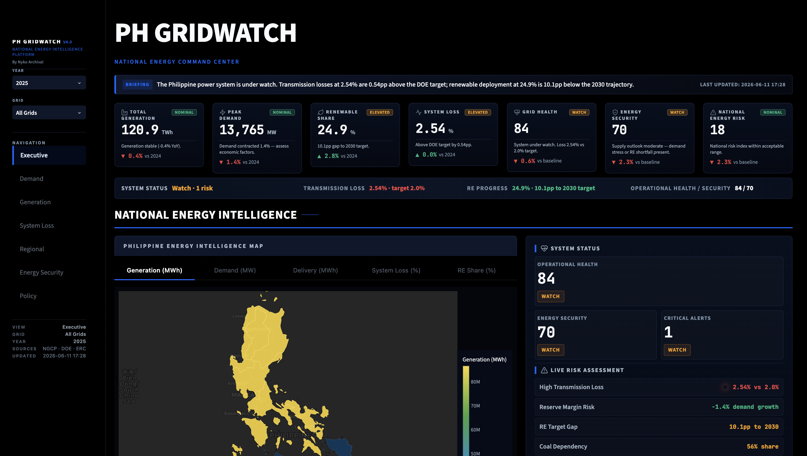
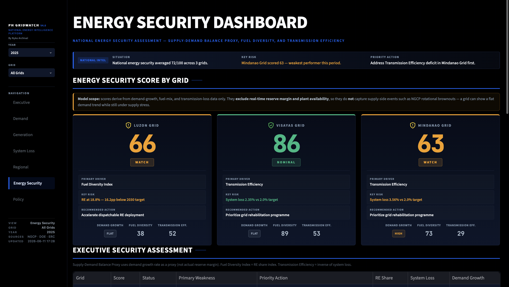
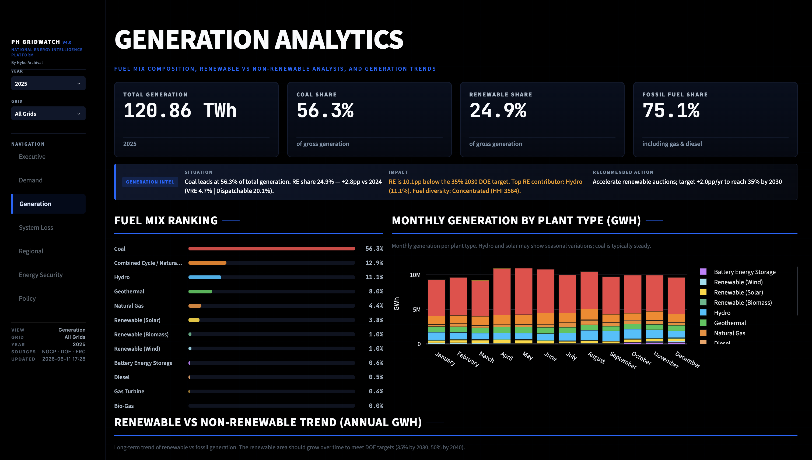

# PH GridWatch

**A national energy intelligence platform for the Philippine power sector.**

PH GridWatch turns NGCP's publicly disclosed operations data into interactive views that make thirteen years of grid history readable, covering demand growth, generation mix, the renewable transition, system loss, regional consumption, energy security, and policy.

Built with Python, Streamlit, and Plotly using publicly disclosed NGCP operational datasets.

> 22,000+ data points · 13 years of grid history · 7 intelligence modules · 3 interconnected grids

## Preview

**Executive dashboard** — national KPIs, energy-intelligence map, and live risk panel



**Energy Security** — composite score per grid, with the Demand Growth framing and model-scope caveat



**Generation analytics** — fuel mix, renewable share, and monthly generation by plant type



## Why I built this

As an electrical engineering student, I've been curious about what's actually happening to the grid in my hometown of Cebu, in Central Visayas, where rotational brownouts are happening. During one of them I went looking for answers on NGCP's website, found their Power Situation Outlook, and from there realized NGCP publicly discloses its operations data going back years.

The data is there, but thirteen years of monthly spreadsheets, more than 22,000 data points in all, is hard to read. It is difficult to see at a glance whether demand is outpacing generation, where transmission losses are worst, or how your grid compares to the other two. I built PH GridWatch to put those years of data into views that make the trends legible, first for myself, then for anyone who wants to understand what the numbers actually say about the grid.

Credit to NGCP for making this operational data public. This project only exists because they disclose it.

## At a glance

- 13 years of operational history (2013–2025)
- 22,000+ data points across four NGCP datasets
- 7 analytical modules
- 3 interconnected grids: Luzon, Visayas, Mindanao
- Regional electricity consumption nationwide
- A composite energy-security score with explicit scope limits

## Executive questions answered

- Is electricity demand growing faster than the grid can support?
- Which grid faces the greatest energy-security risk, and why?
- How concentrated is the Philippine generation portfolio across fuel types?
- Is renewable deployment keeping pace with the national target?
- How much energy is lost in transmission before it reaches consumers?
- Which regions consume the most electricity?
- What policy interventions do the indicators point to?

## Pages

| Page | What it shows |
|------|---------------|
| Executive | National KPIs, a generated briefing, a choropleth intelligence map, and regional summary cards |
| Demand | Hourly load curves, monthly peaks, demand growth, and a 2-year peak forecast (linear regression) |
| Generation | Fuel mix, renewable vs non-renewable split, fuel-concentration index (HHI), and trends |
| System Loss | Monthly loss trends, per-grid comparison, seasonal anomaly flags (z-score), and economic impact |
| Regional | Energy delivery by region with monthly trends and a regional choropleth |
| Energy Security | A composite 0–100 score per grid, pillar breakdown, radar comparison, and historical trend |
| Policy | Scenario comparisons and a policy matrix derived from the underlying indicators |

## Data

All source data comes from NGCP's publicly disclosed operations data, covering 2013 to 2025 (13 years) and about 22,200 data points in total. DOE targets (renewable-energy trajectory, system-loss cap) are used only as benchmarks. The project uses four datasets, with definitions as published by NGCP:

- **Gross Generation Per Plant Type** (3,636 data points) – the energy produced monthly by units classified by the fuel they use.
- **System Loss** (676 data points) – monthly percent Transmission System Loss (TSL) per grid, computed as (Net Generation − Energy from Grid Exit Points) ÷ Net Generation.
- **Hourly Demand** (14,244 data points) – the active power required by load, in MW at hourly intervals, classified per grid. Monthly peaks are derived from this.
- **Energy Delivery Per Region** (3,612 data points) – total electricity consumption per political region, in kWh, as measured for the billing period.

Figures are derived from these published datasets and are intended for exploratory analysis, policy discussion, and educational use.

Region boundaries for the choropleth maps (`ph_regions.json`) come from [simplemaps.com](https://simplemaps.com/gis/country/ph).

## Energy Security Score

The Energy Security Score is an internal composite indicator built for comparative analysis across grids and over time. It is not a formal reserve-margin or generation-adequacy assessment (see [Limitations](#limitations)). It blends three pillars, each scored 0–100:

```
Score = 0.40 × Supply-Demand Balance Proxy   (inverse of demand-growth rate)
      + 0.40 × Fuel Diversity Index           (share of generation from renewables)
      + 0.20 × Transmission Efficiency         (inverse of system loss)
```

Classification: `NOMINAL` (≥80), `WATCH` (60–79), `ELEVATED` (40–59), `CRITICAL` (<40).

The Supply-Demand Balance pillar is a proxy derived from demand-growth rate, not an actual reserve-margin calculation. The dashboard surfaces this caveat in the interface so the score is read as comparative intelligence, not a generation-adequacy study.

## Limitations

PH GridWatch uses only NGCP's publicly disclosed operational datasets. It does not include:

- plant outage or forced-outage data
- reserve-margin or generator-availability figures
- wholesale electricity prices
- distribution-utility performance metrics

Because of this, the Energy Security Score and its Supply-Demand Balance pillar are comparative indicators, not formal adequacy studies. They cannot, for instance, explain a specific rotational brownout, which is a supply-side event the public data does not capture.

## Future work

Natural next steps, several of which would close the gaps noted above:

- Reserve-margin and generator-outage analytics
- Wholesale electricity market indicators
- Distribution-utility performance and grid-reliability statistics
- Public deployment with automated data updates
- More advanced forecasting (seasonal time-series and gradient-boosted models) with probabilistic prediction intervals
- Natural-language queries over the data, with retrieval-augmented (RAG) answers grounded in the actual figures
- A domain-adapted language model for Philippine energy data
- Automated, data-grounded narrative briefings

## Project structure

```
app.py              Entry point: sidebar, global filters, page routing
config.py           Grid list, fuel classifications, targets, colors
data_loader.py      Excel loading and parsing
styles.css          Dashboard styling
ph_regions.json     Region geometry for the choropleth maps
.streamlit/         Theme config
data/               Source spreadsheets (NGCP)
views/              One module per page
services/           Classification, intelligence, and policy logic
utils/              Calculations (scores, forecasts, HHI), icons, CSS loader
components/         Shared UI helpers (KPI cards, status badges, sections)
```

## Running locally

```bash
pip install -r requirements.txt
streamlit run app.py
```

## Stack

Python 3.9+, Streamlit, Plotly, pandas, NumPy, scikit-learn, openpyxl.

Streamlit was a deliberate choice. It let me go from raw spreadsheets to an interactive, deployable interface quickly, which kept the focus on the analysis instead of front-end plumbing, and it shows how fast a working data product can come together with the right tools.

## On AI assistance

I used AI during the design and implementation phase, and I want to be upfront about it. Part of the goal was exactly that: as a student, I wanted real experience using these tools in an actual project rather than toy examples. The motivation, the questions the dashboard asks, the choice of indicators, and the interpretation of the results are mine.

The tools I worked with included Claude (Anthropic), OpenAI Codex, Google Antigravity, and DeepSeek. I used them as assistants for writing and iterating on code, while keeping the domain decisions, the data interpretation, and the honesty caveats (such as the energy-security scope limits) under my own judgment.

More broadly, I think that used well, AI genuinely enhances how we work today. This project is a small example of that: it let me take public data and a question I cared about and turn them into a working analytical tool, faster than I could have alone, while still doing the engineering thinking myself.

## Disclaimer

PH GridWatch is an independent educational and portfolio project. It is not affiliated with NGCP, the DOE, the ERC, or any government agency. All source data remains the property of the original publishing organizations. The dashboard is intended for research, learning, and public-interest analysis.

---

Built by Nyko Archival.
